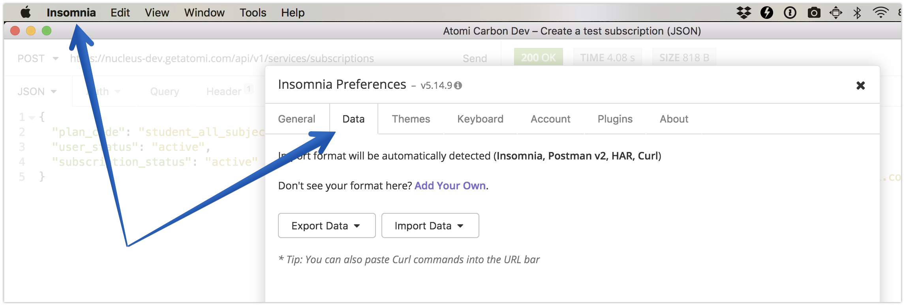

# Atomi tools 🔩

A repo of tools for making day-to-day development easier at Atomi.

Don't be a tool and share your tools 👅. Tools such as the **The remote wrangler:**

## Table of contents

_Let's keep it organised._

* [Atomi tools 🔩](#atomi-tools-%F0%9F%94%A9)
  * [Table of contents](#table-of-contents)
  * [Insomnia](#insomnia)
  * [Editors](#editors)
    * [VS Code](#vs-code)
      * [Settings Sync data](#settings-sync-data)
  * [Git](#git)
    * [Precommit hooks](#precommit-hooks)

## Insomnia

Lets share our data:

1.  **Menu bar:** Insomnia → Preferences → Data.
2.  **Export Data:** choose Insomnia (json) format and name the file after yourself.
3.  Put the file in the [insomnia folder](insomnia).

## Editors

### VS Code

#### [Settings Sync data](https://marketplace.visualstudio.com/items?itemName=Shan.code-settings-sync)

* [Chris Pearce](https://gist.github.com/chris-pearce/fe13265f7f1e0411281e8cfe60ca9c67)

## Git

### Precommit hooks
